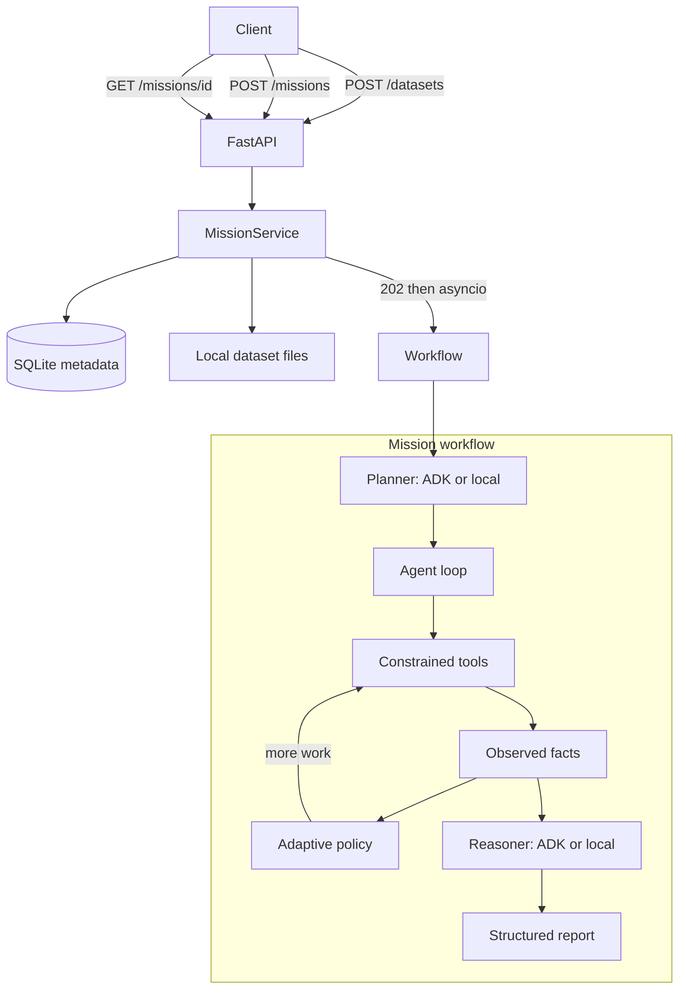

# ATLAS

**Autonomous Task & Lifecycle Agent System**

ATLAS is an autonomous operations agent built for the Google All Things Agentic Hackathon 2026. Instead of requiring step-by-step instructions, ATLAS accepts a high-level goal and autonomously plans, executes, and reports on the work.

> **Round 3 focus:** Real agentic orchestration. ATLAS interprets the mission, produces a structured plan, selects constrained investigation tools, observes their evidence, adapts when the evidence warrants more work, and then reasons over measured facts. It does not blindly run every analysis.

## Problem

Traditional automation requires explicit scripts. A fixed investigation pipeline is only slightly better: it always runs the same six analyses regardless of the goal.

ATLAS now inverts that model for dataset missions:

1. Upload a CSV dataset.
2. Create a mission with a high-level investigation goal and `dataset_id`.
3. The agent decides which capabilities are relevant, invokes them as tools, inspects structured evidence, and may add follow-up work based on what it actually found.
4. Facts come from tools. Interpretation comes from the reasoner. Those layers stay separate.

## What makes ATLAS agentic

ATLAS is agentic because it runs a bounded loop:

**GOAL → UNDERSTAND → PLAN → SELECT WORK → USE TOOLS → OBSERVE RESULTS → REASON → DECIDE WHAT TO DO NEXT → COMPLETE**

That is not a collection of classes named "agent." The loop:

- Interprets the mission goal.
- Writes an inspectable structured plan (tools, task dependencies, status).
- Invokes only allowlisted dataset tools.
- Stores tool output as evidence.
- Decides whether additional investigation is justified by that evidence.
- Stops when the plan is done, a loop limit is reached, or a tool/agent failure occurs.
- Produces a final report that distinguishes observed facts from interpretation.

## Architecture



Replaceable later (not implemented in this round): Cloud Storage, Firestore, Pub/Sub, Cloud Run, specialized agents, persistent memory.

### Mission lifecycle

```
CREATED → PLANNING → EXECUTING → COMPLETED
                              └→ FAILED
```

Dataset missions run the agent loop during `EXECUTING`. Missions without a `dataset_id` keep the Round 1 generic lifecycle.

While the agent is working, the mission also exposes:

- `current_phase` — UNDERSTANDING, PLANNING, TOOL_EXECUTION, OBSERVING, ADAPTING, REASONING, COMPLETING
- `current_task` — active tool name
- `agent_plan` — structured plan (objective, selected tools, tasks, status)
- `tool_invocations` — tool activity
- `evidence_records` — observed facts from tools
- `interpretations` — reasoner text tied to evidence/finding ids
- `events` — operational timeline
- `investigation_report` — final structured result

### Mission planning

The plan is not a paragraph. It is a persisted `agent_plan` object:

- `objective` — restated mission goal
- `selected_tools` — capabilities the agent chose
- `tasks` — ordered work items with `tool_name`, dependencies, arguments, status, and optional adaptive reason
- `status` — `IN_PROGRESS`, `COMPLETED`, or `LIMIT_REACHED`
- `iteration` / `tool_call_count` — loop progress

The Round 1 `execution_plan` is projected from the agent plan so existing clients still see steps.

Initial tool selection:

- **Local mode:** deterministic policy over the goal text. Broad quality/investigation goals select the full quality set. Narrow goals (for example "check only for duplicate rows") select only the matching tools. `profile_dataset` is always first. `inspect_column` is never part of the initial plan.
- **Gemini/ADK mode:** the model proposes tools from the same allowlist. Unknown tools are dropped. If the model returns only a profile, local policy tools are merged in. Tool *execution* still happens inside ATLAS, not as arbitrary model-side code.

### Tool capabilities

Investigation stages from Round 2 are now agent-callable tools bound to the mission dataset:

| Tool | What it measures |
|------|------------------|
| `profile_dataset` | Shape, column names, inferred types, numeric stats |
| `analyze_missing_values` | Per-column missing counts and percentages |
| `analyze_duplicates` | Exact duplicate rows |
| `analyze_type_format` | Numeric/datetime coercion failures; categorical variants |
| `analyze_outliers` | Tukey IQR (1.5×) on eligible numeric columns |
| `analyze_consistency` | Explicit start≤end and non-negative quantity-like rules |
| `inspect_column` | Follow-up on one named column already in the dataset |

Tools return structured evidence (`observed_facts`, optional `findings`/`profile`). They do not interpret impact.

### Adaptive execution

After each tool result, ATLAS evaluates whether extra work is justified by **that output**:

1. If the profile shows an extreme numeric range (`max > 10 × median` with median > 0) and outliers were not planned, it adds `analyze_outliers`.
2. If missing-value analysis finds a column ≥20% missing, it adds `inspect_column` for that column.
3. If type/format analysis finds anomalies, it inspects the first affected column.

These branches do not always fire. A clean numeric file with a duplicates-only goal does not trigger them. A survey file with an extreme `age` value does. Tests cover both sides.

### Evidence vs reasoning

| Layer | Responsibility |
|-------|----------------|
| **Tools** | Measure facts from the bound DataFrame |
| **Evidence records** | Persist those facts with ids |
| **Findings** | Structured quality issues, each with `evidence` and `detection_method` |
| **Reasoner** | Summarize impact and recommend what to fix first |
| **Interpretations** | Reasoner text linked to evidence/finding ids |

The reasoner is not allowed to invent findings, metrics, or columns. Local fallback summaries are templates over measured findings. Gemini, when configured, receives the same measured artifacts.

### Local fallback vs Gemini/ADK

| Mode | When | What happens |
|------|------|----------------|
| `LOCAL_FALLBACK` | `PLANNER_BACKEND=local`, or `auto` without credentials | Policy selects tools. Template reasoner interprets findings. Source is labeled `LOCAL_FALLBACK`. |
| `GEMINI_ADK` | Credentials present and backend is `auto` or `adk` | ADK/Gemini participates in planning, initial tool selection, and interpretation. Facts are still measured by Python tools. Source is labeled `GEMINI_ADK`. |

Local execution is never labeled as Gemini. Tests force local mode and do not call paid APIs.

### Safety boundaries

Agent tools cannot:

- run shell commands
- evaluate arbitrary Python
- read filesystem paths
- read environment secrets
- inspect columns that are not in the mission dataset
- accept arguments outside a per-tool allowlist

The dataset is bound in-memory as `ToolContext`. Tools never receive upload paths. Loop limits cap iterations, tool calls, and runtime (`ATLAS_AGENT_MAX_ITERATIONS`, `ATLAS_AGENT_MAX_TOOL_CALLS`, `ATLAS_AGENT_MAX_RUNTIME_SECONDS`). Remaining planned tasks are marked `SKIPPED` if a limit is hit after a profile exists; otherwise the mission fails.

### Observability

Mission events reconstruct what ATLAS did, without chain-of-thought:

- Mission received / understood
- Plan created
- Tool selected / started / completed / failed
- Evidence received
- Agent decision
- Adaptive investigation triggered
- Loop limit reached (when it happens)
- Final reasoning completed
- Mission completed

Round 2 stage events (`DATASET_PROFILE_COMPLETED`, etc.) are still emitted when the corresponding tool finishes.

## Technology stack

- Python 3.10+
- FastAPI
- pandas (deterministic CSV investigation)
- Google ADK + Gemini (when configured)
- aiosqlite
- pytest + httpx

## Project structure

```
atlas/
├── api/routes/           # /health, /datasets, /missions
├── agent/                # Loop, tools, policy, planner, reasoner (ADK / local)
├── investigation/        # Deterministic CSV analyzers used by tools
├── storage/              # Dataset byte storage (local; Cloud Storage later)
├── persistence/          # SQLite mission + dataset metadata
├── workflow/             # Mission lifecycle (generic + agent loop)
├── services/             # Mission and dataset business logic
├── domain/               # Models, enums, exceptions
└── config/               # Environment settings

tests/
├── fixtures/             # CSV fixtures with intentional quality issues
└── test_*.py
```

## Environment setup

```bash
python -m venv .venv

# Windows
.venv\Scripts\activate

# macOS/Linux
source .venv/bin/activate

pip install -r requirements.txt
cp .env.example .env
```

## Local development

Default configuration uses the **local development fallback**. No Google credentials are required. Dataset investigation still runs against the real uploaded CSV.

```bash
uvicorn atlas.main:app --reload --host 0.0.0.0 --port 8000
```

API docs: `http://localhost:8000/docs`

## API usage

**Health**

```bash
curl http://localhost:8000/health
```

**Upload a CSV**

```bash
curl -X POST http://localhost:8000/datasets \
  -F "file=@path/to/data.csv;type=text/csv"
```

Returns `dataset_id`, original filename, generated stored filename, content type, size, and `created_at`. Filesystem paths are not exposed. Only CSV is accepted.

**Create a dataset investigation mission**

```bash
curl -X POST http://localhost:8000/missions \
  -H "Content-Type: application/json" \
  -d "{\"goal\": \"Analyze this survey dataset, identify the most important quality problems, investigate what may be causing them, and tell me what should be fixed first.\", \"dataset_id\": \"YOUR_DATASET_ID\"}"
```

Returns immediately with HTTP 202. Unknown `dataset_id` values return 404.

**Create a Round 1 mission (no dataset)**

```bash
curl -X POST http://localhost:8000/missions \
  -H "Content-Type: application/json" \
  -d "{\"goal\": \"Review system logs and summarize anomalies.\"}"
```

**Retrieve mission + plan + report**

```bash
curl http://localhost:8000/missions/{mission_id}
```

When a dataset mission completes, the payload includes `agent_plan`, `tool_invocations`, `evidence_records`, `interpretations`, `events`, and `investigation_report`.

## Investigation measurements

Supported input: **CSV only**.

Deterministic analyzers (invoked only when the agent selects them):

1. **Dataset profile** — row/column counts, names, inferred types, numeric min/max/mean/median/std
2. **Missing data** — per-column null counts and percentages; columns ≥20% missing are marked materially incomplete
3. **Duplicates** — exact duplicate row count and percentage
4. **Type / format anomalies** — values that fail numeric or datetime coercion; categorical casing/whitespace variants
5. **Outliers** — Tukey IQR (1.5×) on numeric columns with enough values; skipped for binary or identifier-like columns
6. **Cross-column consistency** — explicit rules only:
   - start/begin vs end/finish datetime columns: start must be ≤ end
   - columns named quantity/qty/count/age/price/amount/duration: values should not be negative
7. **Prioritization** — deterministic rank (1 = highest) from affected-record percentage, category weight, and severity
8. **Report** — structured JSON from measured findings plus reasoner interpretation

ATLAS does **not** infer arbitrary semantic relationships between columns. If a consistency rule cannot be justified, it is not reported.

## Gemini / ADK vs local fallback

Set credentials in `.env` to use real Gemini via Google ADK for planning, initial tool selection, and finding interpretation:

```env
PLANNER_BACKEND=auto
GOOGLE_API_KEY=your-api-key-here
GEMINI_MODEL=gemini-2.5-flash
```

Without credentials, or with `PLANNER_BACKEND=local`:

- `planner_source` / `reasoning_source` is `LOCAL_FALLBACK`
- Tool selection and summaries are rule/template based
- They are never labeled as Gemini output
- CSV measurements still come from the real file

## Running tests

Tests use the local fallback, a temp SQLite database, and a temp upload directory. No paid cloud resources are required.

```bash
pytest -v
```

## What is implemented

### Round 1

- FastAPI health and mission endpoints
- Async mission lifecycle with persisted state and events
- Planner abstraction (Gemini ADK or local fallback)

### Round 2

- CSV dataset upload with validation and safe storage names
- Missions that reference `dataset_id`
- Real CSV investigation analyzers
- Structured findings, deterministic prioritization, final report
- Investigation-stage events
- Parse/analysis failures → `FAILED` with error details
- Round 1 missions without a dataset still work

### Round 3

- Structured, persisted agent plan
- Allowlisted investigation tools returning structured evidence
- Goal-based tool selection (not a fixed six-stage pipeline)
- Adaptive follow-up from actual tool output
- Evidence records distinct from reasoner interpretations
- Operational agent events
- Configurable loop limits
- Local fallback remains fully testable; Gemini/ADK path remains wired

## Known limitations

- CSV only (no XLSX, PDF, or other formats)
- Consistency checks are a small explicit rule set, not general semantic understanding
- Adaptive branches are a defined evidence-driven policy, not an unbounded model-authored workflow
- When Gemini is configured, it selects initial tools and interprets findings; tool execution stays inside ATLAS so evidence and limits remain controlled
- Step execution for missions *without* a dataset is still a lifecycle demonstration, not domain work
- Local filesystem + SQLite (not Cloud Storage / Firestore yet)
- Local asyncio background tasks (not Pub/Sub)
- No frontend, authentication, or production deployment
- This repo's tests always use the local fallback

## Planned for later rounds

- Frontend UI
- Firestore and Cloud Storage
- Pub/Sub and Cloud Run
- Specialized agents and persistent memory
- Additional file types
- Authentication and production security

## License

Built for the Google All Things Agentic Hackathon 2026.
